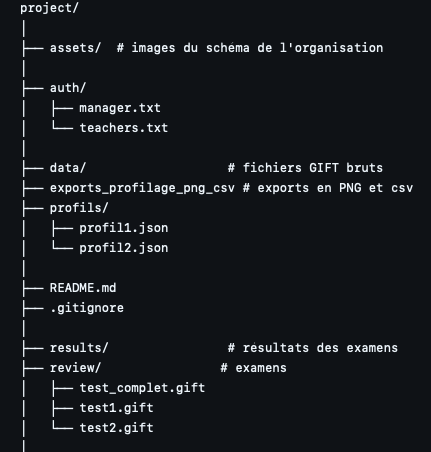
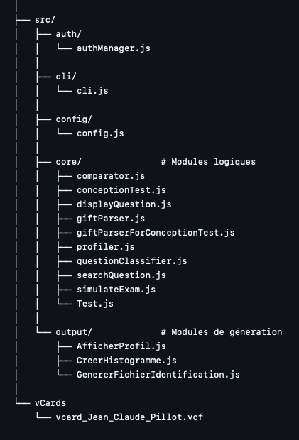

### 💻 GL02 A25 | Outil pour le Ministère de l'Education Nationale de la République de Sealand 🃏

Ce projet consiste à réaliser pour le Ministère de l’Éducation nationale de la République de Sealand un outil permettant aux enseignants de créer et de gérer des examens en ligne au format GIFT depuis une banque de questions certifiée. Egalement, on pourra assurer l’identification des enseignants via le format VCard et simuler la passation du test pour les étudiants. 

**Membres :**

 - BERMUDEZ Lucas,
 - HUANG Jia Rui,
 - CHARLET-SOMLETTE Jules.

**Langage:**

 Javascript

 


**Aide et installation :**

Naviguez vers le répertoire du CLI :

```bash 
cd Projet_GL02_Cronix/src/cli
```

Installez les dépendances requises :

```bash 
npm install canvas 
```

**Dépendances:**

canvas : 3.2.0 (l'installer avec la commande ci-dessus)

**Comment utiliser le logiciel ?**

Après avoir installé canvas, allez dans votre console et mettez vous dans le répertoire du fichier cli.js (Projet_GL02_Cronix > src > cli) et lancez la commande 
```bash 
node cli.js 
```
Sélectionnez votre profil (en tapant 1, 2 ou 3 au clavier) :
1. Etudiant
2. Enseignant
3. Gestionnaire

Si vous vous êtes trompé dans le choix du profil, vous pouvez toujours revenir en arrière. 
Une fois connecté à un profil, vous pourrez toujours quitter le programme en tapant 0 au clavier (correspond à l'option <code>0. Se déconnecter</code>).

Un **étudiant** peut simuler un examen. Pour simuler un examen, rentrez le nom d'un fichier test présent dans Projet_GL02_Cronix > review. Par exemple, vous pouvez rentrer dans la console (ne pas oublier le nom de l'extension .gift) : <code>test_complet.gift</code>. Réalisez le test (test_complet est un peu long ne vous inquiètez pas, vous arriverez au bout).

Un **professeur** est caractérisé par son ID (adresse e-mail) et son mot de passe. Quelques identifiants ont été créés pour que vous puissiez vous authentifier au début. 

Les informations de connexion sont dans auth > teachers.txt.
Voici un compte extrait de ce .txt :

<code>ID:prof1@utt.fr
mdp:password123</code>

Un professeur peut concevoir un test, rechercher une question ou simuler un examen. Libre à vous d'essayer toutes ces fonctions ! Nous avons essayé de les rendre les plus intuitives et guidées possibles.

Enfin, le **gestionnaire** se connecte à l'aide de son mot de passe, présent dans auth > manager.txt.

 - Son mot de passe est : 0102.

Il peut générer un histogramme, un vCard enseignant, profiler une banque de questions, comparer des profils, simuler un examen et, enfin, créer un compte Enseignant.

Vous savez tout désormais, c'est à votre tour d'essayer !

**Explications des écarts au cahier des charges:**

SPEC 4 : 
Il nous est demandé en post-condition : "Les résultats sont fournis à la fin de la simulation, à l’enseignant" 
et, en remarque : "L’enseignant devrait être informé lorsque l’étudiant effectue la simulation".

Pour la post-condition, ce qui a été fait est qu'une fois que l'étudiant termine le test, 
un rapport du test est créé (sous le format .json) et ce fichier est enregistré automatiquement dans
le dossier "résultats" accessible uniquement par le professeur. On considère le professeur notifié 
lorsqu'il verra apparaître le rapport dans ce fichier.

Aussi nous avons ajouté une possibilité d'exporter les résultats (CSV, PNG, JSON). Ce n'était pas mentionné dans le cahier des charges, c'est donc un ajout de notre part.

**Qui a fait quoi dans ce projet ?**

BERMUDEZ Lucas :
 - répartition des fonctions au début du projet,
 - giftParserForConceptionTest.js,
 - searchQuestion.js,
 - Test.js,
 - conceptionTest.js,
 - displayQuestion.js,
 - questionClassifier.js.

HUANG Jia Rui :
 - GenererFichierIdentification.js,
 - AfficherProfil.js
 - CreerHistogramme.js

CHARLET SOMLETTE Jules :
 - profiler.js,
 - comparator.js,
 - giftParser.js,
 - simulateExam.js,
 - config.js (gestion centralisée des chemins d'acccès du projet),
 - authManager.js (système d'authentification),
 - réorganisation propre du projet (voir structure à la fin du README). 

Tout le monde : cli.js


**Détails du projet :**

Cette interface en ligne de commande permet :
  - de concevoir un test (SPEC 1 et 5),
  - de rechercher et visualiser des questions (SPEC 2),
  - de créer un fichier d'identification enseignant (SPEC 3),
  - de simuler un examen (SPEC 4),
  - de générer un profil de questions (SPEC 6 et 7),
  - de comparer deux profils (SPEC 8),
  - d'exporter les résultats (CSV, PNG, JSON),
  - d'afficher les statistiques en ASCII.

L'outil prend en entrée des fichiers GIFT contenant des questions du type :
- Multiple choice (MC),
- Open cloze,
- Word formation,
- Key word Transformation (KWT),
- Gap fill multi réponses,
- Métadonnées ([html], $CATEGORY, etc.).

**Fonctionnalités principales :**

1. **Conception / génération d’examen** (SPEC 1)

Le programme permet à un enseignant de construire un examen à partir d’une banque de questions certifiée :

- sélection de questions depuis une ou plusieurs banques GIFT,
- ajout / suppression de questions dans l’examen,
- génération d’un fichier d’examen final au format `.gift`,
- sauvegarde de l’examen dans le dossier `review/` (via config).

Sortie :
- un fichier examen `.gift` prêt à être simulé / analysé.

---

2. **Recherche et visualisation de questions** (SPEC 2)

Le programme permet de retrouver rapidement une question dans une banque :

- recherche par mots-clés (titre ou contenu),
- filtrage par type de question,
- support des expressions régulières (regex),
- affichage clair dans la console (titre, consigne, réponses possibles).

Sortie :
- liste de questions affichée dans la console,
- possibilité d’ajouter une question trouvée à un examen (lien avec SPEC 1).

---

3. **Génération d’un fichier d’identification enseignant** (SPEC 3)

Le programme assure l’identification des enseignants au format vCard :

- recherche / sélection d’un enseignant (saisie guidée),
- collecte des informations (nom, prénom, email, téléphone, matières…),
- validation simple du format email à la saisie,
- génération automatique d’une vCard.

Sortie :
- un fichier `.vcf` enregistré dans `results/vcards/`.

---

4. **Simulation d'examen** (SPEC 4)

Le programme :
- lit les fichiers GIFT d'examens (créés par un professeur ou fournis),
- pose toutes les questions à l’étudiant (selon les types supportés),
- accepte plusieurs réponses pour une même question si prévues dans le GIFT,
- n’affiche jamais la correction à l’étudiant,
- génère automatiquement à la fin de l’examen un rapport JSON dans `./results/`.

Exemple de sortie :

<code>Test terminé.
(Rapport enseignant → ./results/simulation_<timestamp>.json)</code>

---

5. **Validation de la qualité d’un examen** (SPEC 5)

Le programme vérifie qu’un fichier d’examen respecte les contraintes :

- unicité des questions (pas de doublons),
- respect des limites de taille / nombre,
- cohérence de la structure GIFT,
- messages d’erreur / avertissements clairs en console.

Sortie :
- examen validé ou rejeté avec explications en console.

---

6. **Histogramme des types de questions** (SPEC 6)

Le programme calcule et affiche la répartition des types de questions d’un examen ou d’une banque :

- détection automatique du type de chaque question,
- comptage par catégorie (QCM, QRO, V/F, Corresp, Num, Trous),
- production d’un profil simple.

Sortie :
- histogramme ASCII et profil simple affichés en console.
- exports optionnels en PNG et/ou CSV

---

7. **Profilage** (SPEC 7)

Le programme crée le profil détaillé des types de questions.

Sortie :
- `profil.json`
- un histogramme ASCII
- exports optionnels en PNG et/ou CSV

---

8. **Comparaison de profils** (SPEC 8)

Le programme compare deux profils et affiche les écarts par type de questions.

Sortie :
- `comparison.json`
- affichage console des différences de pourcentage.


**Structure d'un fichier GIFT supporté** :

Multiple choice :


<code>::Q1:: Who invented the telephone?
{~Edison ~Tesla =Bell}</code>

Open cloze :

<code>::Gap1:: She {=has} been working here for 3 years.
</code>

Key word transformation (parfois nommé KWT dans les programmes)

<code>::U7 p77 [KWT]::[html]It was too foggy...
{=so foggy we could =so foggy that we could}
</code>

Word formation :

<code>::WF1:: [html] He is very {=competitive}.
</code>

**Où seront enregistrés les résultats des tests étudiants ?**

Tout est centralisé dans 

<code> ./results/

Ce dossier est accessible que par les professeurs pour venir regarder les résultats de leurs étudiants. Chaque fichier contient l'identifiant de l'étudiant, son % de bonnes réponses, son nombre de bonnes réponses, son heure de passage de l'examen ainsi que toutes ses réponses et les réponses attendues détaillées.

**Structure du projet** :

<p align="center">
  
</p> <p align="center">
  
</p>
