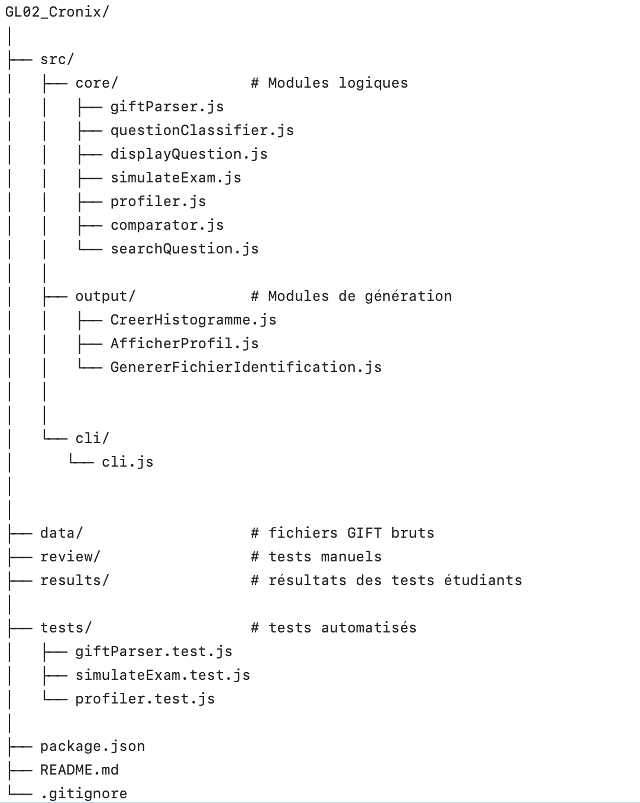

### 💻 GL02 A25 | Outil pour le Ministère de l'Education Nationale de la République de Sealand 🃏

Ce projet consiste à réaliser pour le Ministère de l’Éducation nationale de la République de Sealand un outil permettant aux enseignants de créer et de gérer des examens en ligne au format GIFT depuis une banque de questions certifiée. Egalement, on pourra assurer l’identification des enseignants via le format VCard et simuler la passation du test pour les étudiants. 

**Membres:**

BERMUDEZ Lucas,
HUANG Jia Rui,
CHARLET-SOMLETTE Jules.

**Langage:**

 Javascript

 


**Aide et installation :**

```bash
npm install
```

Au besoin : ```bash 
npm install canvas 
```

**Dépendances:**

canvas : 3.2.0

**Explications des écarts au cahier des charges:**

SPEC 4 : 
Il nous est demandé en post-condition : "Les résultats sont fournis à la fin de la simulation, à l’enseignant" 
et, en remarque : "L’enseignant devrait être informé lorsque l’étudiant effectue la simulation".

Pour la post-condition, ce qui a été fait est qu'une fois que l'étudiant termine le test, 
un rapport du test est créé (sous le format .json) et ce fichier est enregistré automatiquement dans
le dossier "résultats" accessible uniquement par le professeur. On considère le professeur notifié 
lorsqu'il verra apparaître le rapport dans ce fichier.

**Détails du projet :**

Cette interface en ligne de commande permet :
  - de concevoir un test (SPEC 1 et 5),
  - de rechercher et visualiser des questions (SPEC 2),
  - de créer un fichier d'identification enseignant (SPEC 3),
  - de simuler un examen (SPEC 4),
  - de générer un profil de questions (SPEC 6 et 7),
  - de comparer deux profils (SPEC 8),
  - d'exporter les résultats (CSV, PNG, JSON),
  - d'afficher les statistiques en ASCII.

L'outil prend en entrée des fichiers GIFT contenant des questions du type :
- Multiple choice (MC),
- Open cloze,
- Word formation,
- Key word Transformation,
- Gap fill multi réponses,
- Métadonnées ([html], $CATEGORY, etc.).

**Fonctionnalités principales :**

1. **Simulation d'examen** (SPEC 4) :

Le programme :
 - lit les fichiers gift d'examens (créé préalablement par un professeur ou dans le jeu de données fourni),
 - pose toutes les questions à l'étudiant (selon les types de questions défini plus haut)
 - accepte plusieurs réponses pour une même question (si plusieurs réponses possibles sont proposées dans le fichier gift),
 - n'affiche jamais la correction pour l'étudiant,
 - génère automatiquement à la fin de l'examen un rapport JSON dans ./results/

Exemple de sortie :

<code>Test terminé.
(Rapport enseignant → /Users/jules/Downloads/GL02_Cronix/results/simulation_1765010551708.json)</code>

2. **Profilage** (SPEC 7)

Le programme crée le profil des types de questions.

Sortie :
 - profil.json
 - un historigramme ASCII
 - exports optionnels en PNG et/ou CSV 

3. **Comparaison de profils** (SPEC 8)

Le programme affiche les différences de pourcentage par type de questions.

Sortie : 
 - comparison.json

----------------

**Structure d'un fichier GIFT supporté** :

Multiple choice :


<code>::Q1:: Who invented the telephone?
{~Edison ~Tesla =Bell}</code>

Open cloze :

<code>::Gap1:: She {=has} been working here for 3 years.
</code>

Key word transformation (parfois nommé KWT dans les programmes)

<code>::U7 p77 [KWT]::[html]It was too foggy...
{=so foggy we could =so foggy that we could}
</code>

Word formation :

<code>::WF1:: [html] He is very {=competitive}.
</code>

**Où seront enregistrés les résultats des tests étudiants ?**

Tout est centralisé dans 

<code> ./results/result_<fichier>_<timestamp>.json</code>

Ce dossier est accessible que par les professeurs pour venir regarder les résultats de leurs étudiants. Chaque fichier contient l'identifiant de l'étudiant, son % de bonnes réponses, son nombre de bonnes réponses, son heure de passage de l'examen ainsi que toutes ses réponses et les réponses attendues détaillées.

**Structure du projet** :

<p align="center">
  
</p>
